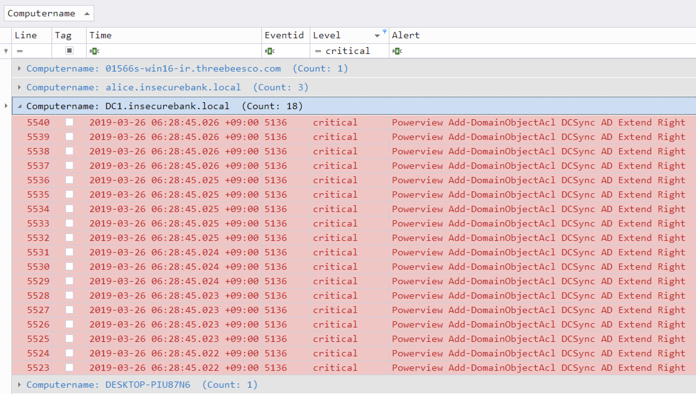
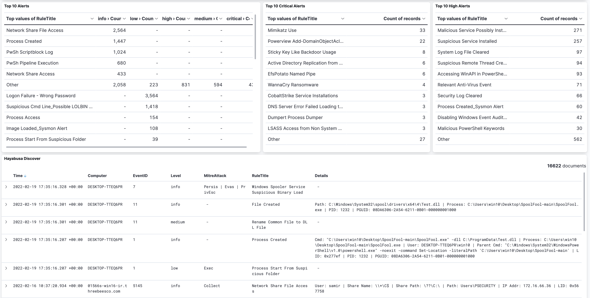

<div align="center">
 <p>
    
 </p>
  [<a href="README.md">English</a>] | [<b>日本語</b>]
</div>

---

[tag-1]: https://img.shields.io/github/downloads/Yamato-Security/hayabusa/total?style=plastic&label=GitHub%F0%9F%A6%85DownLoads
[tag-2]: https://img.shields.io/github/stars/Yamato-Security/hayabusa?style=plastic&label=GitHub%F0%9F%A6%85Stars
[tag-3]: https://img.shields.io/github/v/release/Yamato-Security/hayabusa?display_name=tag&label=latest-version&style=plastic
[tag-4]: https://img.shields.io/badge/Black%20Hat%20Arsenal-Asia%202022-blue
[tag-5]: https://rust-reportcard.xuri.me/badge/github.com/Yamato-Security/hayabusa
[tag-6]: https://img.shields.io/badge/Maintenance%20Level-Actively%20Developed-brightgreen.svg
[tag-7]: https://img.shields.io/badge/Twitter-00acee?logo=twitter&logoColor=white

![tag-1] ![tag-2] <a href="https://github.com/Yamato-Security/hayabusa/releases">![tag-3]</a> ![tag-4]
<a href="https://rust-reportcard.xuri.me/report/github.com/Yamato-Security/hayabusa">![tag-5]</a> ![tag-6]  <a href="https://twitter.com/SecurityYamato">![tag-7]</a>


# Hayabusa について

Hayabusaは、日本の[Yamato Security](https://yamatosecurity.connpass.com/)グループによって作られた**Windowsイベントログのファストフォレンジックタイムライン生成**および**スレットハンティングツール**です。 Hayabusaは日本語で[「ハヤブサ」](https://en.wikipedia.org/wiki/Peregrine_falcon)を意味し、ハヤブサが世界で最も速く、狩猟(hunting)に優れ、とても訓練しやすい動物であることから選ばれました。[Rust](https://www.rust-lang.org/) で開発され、マルチスレッドに対応し、可能な限り高速に動作するよう配慮されています。[Sigma](https://github.com/SigmaHQ/Sigma)ルールをHayabusaルール形式に変換する[ツール](https://github.com/Yamato-Security/hayabusa-rules/tree/main/tools/sigmac)も提供しています。Hayabusaの検知ルールもSigmaと同様にYML形式であり、カスタマイズ性や拡張性に優れます。稼働中のシステムで実行してライブ調査することも、複数のシステムからログを収集してオフライン調査することも可能です。(※現時点では、リアルタイムアラートや定期的なスキャンには対応していません。) 出力は一つのCSVタイムラインにまとめられ、Excel、[Timeline Explorer](https://ericzimmerman.github.io/#!index.md)、[Elastic Stack](doc/ElasticStackImport/ElasticStackImport-Japanese.md)等で簡単に分析できるようになります。

## 目次

- [Hayabusa について](#hayabusa-について)
  - [目次](#目次)
  - [主な目的](#主な目的)
    - [スレット(脅威)ハンティング](#スレット脅威ハンティング)
    - [フォレンジックタイムラインの高速生成](#フォレンジックタイムラインの高速生成)
- [スクリーンショット](#スクリーンショット)
  - [起動画面](#起動画面)
  - [ターミナル出力画面](#ターミナル出力画面)
  - [イベント頻度タイムライン出力画面 (`-V`オプション)](#イベント頻度タイムライン出力画面--vオプション)
  - [結果サマリ画面](#結果サマリ画面)
  - [Excelでの解析](#excelでの解析)
  - [Timeline Explorerでの解析](#timeline-explorerでの解析)
  - [Criticalアラートのフィルタリングとコンピュータごとのグルーピング](#criticalアラートのフィルタリングとコンピュータごとのグルーピング)
  - [Elastic Stackダッシュボードでの解析](#elastic-stackダッシュボードでの解析)
- [タイムラインのサンプル結果](#タイムラインのサンプル結果)
- [特徴＆機能](#特徴機能)
- [予定されている機能](#予定されている機能)
- [ダウンロード](#ダウンロード)
- [Gitクローン](#gitクローン)
- [アドバンス: ソースコードからのコンパイル（任意）](#アドバンス-ソースコードからのコンパイル任意)
  - [Rustパッケージの更新](#rustパッケージの更新)
  - [32ビットWindowsバイナリのクロスコンパイル](#32ビットwindowsバイナリのクロスコンパイル)
  - [macOSでのコンパイルの注意点](#macosでのコンパイルの注意点)
  - [Linuxでのコンパイルの注意点](#linuxでのコンパイルの注意点)
- [Hayabusaの実行](#hayabusaの実行)
  - [注意: アンチウィルス/EDRの誤検知](#注意-アンチウィルスedrの誤検知)
  - [Windows](#windows)
  - [Linux](#linux)
  - [macOS](#macos)
- [使用方法](#使用方法)
  - [コマンドラインオプション](#コマンドラインオプション)
  - [使用例](#使用例)
  - [ピボットキーワードの作成](#ピボットキーワードの作成)
  - [ログオン情報の要約](#ログオン情報の要約)
- [サンプルevtxファイルでHayabusaをテストする](#サンプルevtxファイルでhayabusaをテストする)
- [Hayabusaの出力](#hayabusaの出力)
  - [MITRE ATT&CK戦術の省略](#mitre-attck戦術の省略)
  - [Channel情報の省略](#channel情報の省略)
  - [プログレスバー](#プログレスバー)
  - [標準出力へのカラー設定](#標準出力へのカラー設定)
  - [イベント頻度タイムライン](#イベント頻度タイムライン)
  - [最多検知日の出力](#最多検知日の出力)
  - [最多検知端末名の出力](#最多検知端末名の出力)
- [Hayabusaルール](#hayabusaルール)
  - [Hayabusa v.s. 変換されたSigmaルール](#hayabusa-vs-変換されたsigmaルール)
  - [検知ルールのチューニング](#検知ルールのチューニング)
  - [検知レベルのlevelチューニング](#検知レベルのlevelチューニング)
  - [イベントIDフィルタリング](#イベントidフィルタリング)
- [その他のWindowsイベントログ解析ツールおよび関連リソース](#その他のwindowsイベントログ解析ツールおよび関連リソース)
- [Windowsイベントログ設定のススメ](#windowsイベントログ設定のススメ)
- [Sysmon関係のプロジェクト](#sysmon関係のプロジェクト)
- [コミュニティによるドキュメンテーション](#コミュニティによるドキュメンテーション)
  - [英語](#英語)
  - [日本語](#日本語)
- [貢献](#貢献)
- [バグの報告](#バグの報告)
- [ライセンス](#ライセンス)
- [Twitter](#twitter)

## 主な目的

### スレット(脅威)ハンティング

Hayabusaには現在、2300以上のSigmaルールと130以上のHayabusa検知ルールがあり、定期的にルールが追加されています。 最終的な目標はインシデントレスポンスや定期的なスレットハンティングのために、HayabusaエージェントをすべてのWindows端末にインストールして、中央サーバーにアラートを返す仕組みを作ることです。

### フォレンジックタイムラインの高速生成

Windowsのイベントログは、
  1）解析が困難なデータ形式であること
  2）データの大半がノイズであり調査に有用でないこと
から、従来は非常に長い時間と手間がかかる解析作業となっていました。 Hayabusa は、有用なデータのみを抽出し、専門的なトレーニングを受けた分析者だけでなく、Windowsのシステム管理者であれば誰でも利用できる読みやすい形式で提示することを主な目的としています。
[Evtx Explorer](https://ericzimmerman.github.io/#!index.md)や[Event Log Explorer](https://eventlogxp.com/)のような深掘り分析を行うツールの代替ではなく、分析者が20%の時間で80%の作業を行えるようにすることを目的としています。

# スクリーンショット

## 起動画面


## ターミナル出力画面


## イベント頻度タイムライン出力画面 (`-V`オプション)


## 結果サマリ画面


## Excelでの解析


## Timeline Explorerでの解析


## Criticalアラートのフィルタリングとコンピュータごとのグルーピング



## Elastic Stackダッシュボードでの解析




# タイムラインのサンプル結果

CSVのタイムライン結果のサンプルは[こちら](https://github.com/Yamato-Security/hayabusa/tree/main/sample-results)で確認できます。

CSVのタイムラインをExcelやTimeline Explorerで分析する方法は[こちら](doc/CSV-AnalysisWithExcelAndTimelineExplorer-Japanese.pdf)で紹介しています。

CSVのタイムラインをElastic Stackにインポートする方法は[こちら](doc/ElasticStackImport/ElasticStackImport-Japanese.md)で紹介しています。

# 特徴＆機能

* クロスプラットフォーム対応: Windows, Linux, macOS。
* Rustで開発され、メモリセーフでハヤブサよりも高速です！
* マルチスレッド対応により、最大5倍のスピードアップを実現。
* フォレンジック調査やインシデントレスポンスのために、分析しやすいCSVタイムラインを作成します。
* 読みやすい/作成/編集可能なYMLベースのHayabusaルールで作成されたIoCシグネチャに基づくスレット。
* SigmaルールをHayabusaルールに変換するためのSigmaルールのサポートがされています。
* 現在、他の類似ツールに比べ最も多くのSigmaルールをサポートしており、カウントルールにも対応しています。
* イベントログの統計。(どのような種類のイベントがあるのかを把握し、ログ設定のチューニングに有効です。)
* 不良ルールやノイズの多いルールを除外するルールチューニング設定が可能です。
* MITRE ATT&CKとのマッピング (CSVの出力ファイルのみ)。
* ルールレベルのチューニング。
* イベントログから不審なユーザやファイルを素早く特定するためのピボットキーワードの一覧作成。
* 詳細な調査のために全フィールド情報の出力。
* 成功と失敗したユーザログオンの要約。

# 予定されている機能

* すべてのエンドポイントでの企業全体のスレットハンティング。
* MITRE ATT&CKのヒートマップ生成機能。

# ダウンロード

[Releases](https://github.com/Yamato-Security/hayabusa/releases)ページからHayabusaの安定したバージョンでコンパイルされたバイナリが含まれている最新版もしくはソースコードをダウンロードできます。

# Gitクローン

以下の`git clone`コマンドでレポジトリをダウンロードし、ソースコードからコンパイルして使用することも可能です：

```bash
git clone https://github.com/Yamato-Security/hayabusa.git --recursive
```

**注意：** mainブランチは開発中のバージョンです。まだ正式にリリースされていない新機能が使えるかもしれないが、バグがある可能性もあるので、テスト版だと思って下さい。

※ `--recursive`をつけ忘れた場合、サブモジュールとして管理されている`rules`フォルダ内のファイルはダウンロードされません。

`git pull --recurse-submodules`コマンド、もしくは以下のコマンドで`rules`フォルダを同期し、Hayabusaの最新のルールを更新することができます:

```bash
hayabusa-1.3.0-win-x64.exe -u
```

アップデートが失敗した場合は、`rules`フォルダの名前を変更してから、もう一回アップデートしてみて下さい。

>> 注意: アップデートを実行する際に `rules` フォルダは [hayabusa-rules](https://github.com/Yamato-Security/hayabusa-rules) レポジトリの最新のルールとコンフィグファイルに置き換えられます
>> 既存ファイルへの修正はすべて上書きされますので、アップデート実行前に編集したファイルのバックアップをおすすめします。
>> もし、`--level-tuning` を行っているのであれば、アップデート後にルールファイルの再調整をしてください
>> `rules`フォルダ内に新しく追加したルールは、アップデート時に上書きもしくは削除は行われません。

# アドバンス: ソースコードからのコンパイル（任意）

Rustがインストールされている場合、以下のコマンドでソースコードからコンパイルすることができます:

```bash
cargo clean
cargo build --release
```

以下のコマンドで定期的にRustをアップデートしてください：
```bash
rustup update stable
```

コンパイルされたバイナリは`target/release`フォルダ配下で作成されます。

## Rustパッケージの更新

コンパイル前に最新のRust crateにアップデートすることで、最新のライブラリを利用することができます:

```bash
cargo update
```

※ アップデート後、何か不具合がありましたらお知らせください。

## 32ビットWindowsバイナリのクロスコンパイル

以下のコマンドで64ビットのWindows端末で32ビットのバイナリをクロスコンパイルできます:

```bash
rustup install stable-i686-pc-windows-msvc
rustup target add i686-pc-windows-msvc
rustup run stable-i686-pc-windows-msvc cargo build --release
```

## macOSでのコンパイルの注意点

opensslについてのコンパイルエラーが表示される場合は、[Homebrew](https://brew.sh/)をインストールしてから、以下のパッケージをインストールする必要があります：

```bash
brew install pkg-config
brew install openssl
```

## Linuxでのコンパイルの注意点

opensslについてのコンパイルエラーが表示される場合は、以下のパッケージをインストールする必要があります。

Ubuntu系のディストロ:

```bash
sudo apt install libssl-dev
```

Fedora系のディストロ:

```bash
sudo yum install openssl-devel
```

# Hayabusaの実行

## 注意: アンチウィルス/EDRの誤検知

Hayabusa実行する際や、`.yml`ルールのダウンロードや実行時にルール内でdetectionに不審なPowerShellコマンドや`mimikatz`のようなキーワードが書かれている際に、アンチウィルスやEDRにブロックされる可能性があります。
誤検知のため、セキュリティ対策の製品がHayabusaを許可するように設定する必要があります。
マルウェア感染が心配であれば、ソースコードを確認した上で、自分でバイナリをコンパイルして下さい。

## Windows

コマンドプロンプトやWindows Terminalから32ビットもしくは64ビットのWindowsバイナリをHayabusaのルートディレクトリから実行します。
例: `hayabusa-1.3.0-windows-x64.exe`

## Linux

まず、バイナリに実行権限を与える必要があります。

```bash
chmod +x ./hayabusa-1.3.0-linux-x64-gnu
```

次に、Hayabusaのルートディレクトリから実行します：

```bash
./hayabusa-1.3.0-linux-x64-gnu
```

## macOS

まず、ターミナルやiTerm2からバイナリに実行権限を与える必要があります。

```bash
chmod +x ./hayabusa-1.3.0-mac-intel
```

次に、Hayabusaのルートディレクトリから実行してみてください：

```bash
./hayabusa-1.3.0-mac-intel
```

macOSの最新版では、以下のセキュリティ警告が出る可能性があります：


macOSの環境設定から「セキュリティとプライバシー」を開き、「一般」タブから「このまま許可」ボタンをクリックしてください。


その後、ターミナルからもう一回実行してみてください：

```bash
./hayabusa-1.3.0-mac-intel
```

以下の警告が出るので、「開く」をクリックしてください。


これで実行できるようになります。

# 使用方法

## コマンドラインオプション

```bash
USAGE:
    -d, --directory [DIRECTORY] '.evtxファイルを持つディレクトリのパス。'
    -f, --filepath [FILE_PATH] '1つの.evtxファイルのパス。'
    -F, --full-data '全てのフィールド情報を出力する。'
    -r, --rules [RULE_DIRECTORY/RULE_FILE] 'ルールファイルまたはルールファイルを持つディレクトリ。(デフォルト: ./rules)'
    -C, --config [RULE_CONFIG_DIRECTORY] 'ルールフォルダのコンフィグディレクトリ(デフォルト: ./rules/config)'
    -o, --output [CSV_TIMELINE] 'タイムラインをCSV形式で保存する。(例: results.csv)'
    --all-tags '出力したCSVファイルにルール内のタグ情報を全て出力する。'
    -R, --display-record-id 'EventRecordIDを出力する。'
    -v, --verbose '詳細な情報を出力する。'
    -V, --visualize-timeline 'イベント頻度タイムラインを出力する。'
    -D, --enable-deprecated-rules 'Deprecatedルールを有効にする。'
    -n, --enable-noisy-rules 'Noisyルールを有効にする。'
    -u, --update-rules 'rulesフォルダをhayabusa-rulesのgithubリポジトリの最新版に更新する。'
    -m, --min-level [LEVEL] '結果出力をするルールの最低レベル。(デフォルト: informational)'
    -l, --live-analysis 'ローカル端末のC:\Windows\System32\winevt\Logsフォルダを解析する。(Windowsのみ。管理者権限が必要。)'
    --start-timeline [START_TIMELINE] '解析対象とするイベントログの開始時刻。(例: "2018-11-28 12:00:00 +09:00")'
    --end-timeline [END_TIMELINE] '解析対象とするイベントログの終了時刻。(例: "2021-11-28 12:00:00 +09:00")'
    --rfc-2822 'RFC 2822形式で日付と時刻を出力する。(例: Mon, 07 Aug 2006 12:34:56 -0600)'
    --rfc-3339 'RFC 3339形式で日付と時刻を出力する。 (例: 2006-08-07T12:34:56.485214 -06:00)'
    -U, --utc 'UTC形式で日付と時刻を出力する。(デフォルト: 現地時間)'
    --no-color 'カラー出力を無効にする。'
    -t, --thread-number [NUMBER] 'スレッド数。(デフォルト: パフォーマンスに最適な数値)'
    -s, --statistics 'イベント ID の統計情報を表示する。'
    -L, --logon-summary '成功と失敗したログオン情報の要約を出力する。'
    -q, --quiet 'Quietモード。起動バナーを表示しない。'
    -Q, --quiet-errors 'Quiet errorsモード。エラーログを保存しない。'
    --level-tuning [LEVEL_TUNING_FILE] 'ルールlevelのチューニング (default: ./rules/config/level_tuning.txt)'
    -p, --pivot-keywords-list 'ピボットキーワードの一覧作成。'
    --contributors 'コントリビュータの一覧表示。'
```

## 使用例

* １つのWindowsイベントログファイルに対してHayabusaを実行します:

```bash
hayabusa-1.3.0-win-x64.exe -f eventlog.evtx
```

* 複数のWindowsイベントログファイルのあるsample-evtxディレクトリに対して、Hayabusaを実行します:

```bash
hayabusa-1.3.0-win-x64.exe -d .\hayabusa-sample-evtx
```

* 全てのフィールド情報も含めて１つのCSVファイルにエクスポートして、Excel、Timeline Explorer、Elastic Stack等でさらに分析することができます:

```bash
hayabusa-1.3.0-win-x64.exe -d .\hayabusa-sample-evtx -o results.csv -F
```

* Hayabusaルールのみを実行します（デフォルトでは `-r .\rules` にあるすべてのルールが利用されます）:

```bash
hayabusa-1.3.0-win-x64.exe -d .\hayabusa-sample-evtx -r .\rules\hayabusa -o results.csv
```

* Windowsでデフォルトで有効になっているログに対してのみ、Hayabusaルールを実行します:

```bash
hayabusa-1.3.0-win-x64.exe -d .\hayabusa-sample-evtx -r .\rules\hayabusa\default -o results.csv
```

* Sysmonログに対してのみHayabusaルールを実行します:

```bash
hayabusa-1.3.0-win-x64.exe -d .\hayabusa-sample-evtx -r .\rules\hayabusa\sysmon -o results.csv
```

* Sigmaルールのみを実行します:

```bash
hayabusa-1.3.0-win-x64.exe -d .\hayabusa-sample-evtx -r .\rules\sigma -o results.csv
```

* 廃棄(deprecated)されたルール(`status`が`deprecated`になっているルール)とノイジールール(`.\rules\config\noisy_rules.txt`にルールIDが書かれているルール)を有効にします:

```bash
hayabusa-1.3.0-win-x64.exe -d .\hayabusa-sample-evtx --enable-deprecated-rules --enable-noisy-rules -o results.csv
```

* ログオン情報を分析するルールのみを実行し、UTCタイムゾーンで出力します:

```bash
hayabusa-1.3.0-win-x64.exe -d .\hayabusa-sample-evtx -r .\rules\hayabusa\default\events\Security\Logons -U -o results.csv
```

* 起動中のWindows端末上で実行し（Administrator権限が必要）、アラート（悪意のある可能性のある動作）のみを検知します:

```bash
hayabusa-1.3.0-win-x64.exe -l -m low
```

* criticalレベルのアラートからピボットキーワードの一覧を作成します(結果は結果毎に`keywords-Ip Address.txt`や`keyworss-Users.txt`等に出力されます):

```bash
hayabusa-1.3.0-win-x64.exe -l -m critical -p -o keywords
```

* イベントIDの統計情報を取得します:

```bash
hayabusa-1.3.0-win-x64.exe -f Security.evtx -s
```

* 詳細なメッセージを出力します(処理に時間がかかるファイル、パースエラー等を特定するのに便利):

```bash
hayabusa-1.3.0-win-x64.exe -d .\hayabusa-sample-evtx -v
```

* Verbose出力の例:

```bash
Checking target evtx FilePath: "./hayabusa-sample-evtx/YamatoSecurity/T1027.004_Obfuscated Files or Information\u{a0}Compile After Delivery/sysmon.evtx"
1 / 509 [>-------------------------------------------------------------------------------------------------------------------------------------------] 0.20 % 1s 
Checking target evtx FilePath: "./hayabusa-sample-evtx/YamatoSecurity/T1558.004_Steal or Forge Kerberos Tickets AS-REP Roasting/Security.evtx"
2 / 509 [>-------------------------------------------------------------------------------------------------------------------------------------------] 0.39 % 1s 
Checking target evtx FilePath: "./hayabusa-sample-evtx/YamatoSecurity/T1558.003_Steal or Forge Kerberos Tickets\u{a0}Kerberoasting/Security.evtx"
3 / 509 [>-------------------------------------------------------------------------------------------------------------------------------------------] 0.59 % 1s 
Checking target evtx FilePath: "./hayabusa-sample-evtx/YamatoSecurity/T1197_BITS Jobs/Windows-BitsClient.evtx"
4 / 509 [=>------------------------------------------------------------------------------------------------------------------------------------------] 0.79 % 1s 
Checking target evtx FilePath: "./hayabusa-sample-evtx/YamatoSecurity/T1218.004_Signed Binary Proxy Execution\u{a0}InstallUtil/sysmon.evtx"
5 / 509 [=>------------------------------------------------------------------------------------------------------------------------------------------] 0.98 % 1s
```

* エラーログの出力をさせないようにする:
デフォルトでは、Hayabusaはエラーメッセージをエラーログに保存します。
エラーメッセージを保存したくない場合は、`-Q`を追加してください。

## ピボットキーワードの作成

`-p`もしくは`--pivot-keywords-list`オプションを使うことで不審なユーザやホスト名、プロセスなどを一覧で出力することができ、イベントログから素早く特定することができます。
ピボットキーワードのカスタマイズは`config/pivot_keywords.txt`を変更することで行うことができます。以下はデフォルトの設定になります:

```
Users.SubjectUserName
Users.TargetUserName
Users.User
Logon IDs.SubjectLogonId
Logon IDs.TargetLogonId
Workstation Names.WorkstationName
Ip Addresses.IpAddress
Processes.Image
```

形式は`KeywordName.FieldName`となっています。例えばデフォルトの設定では、`Users`というリストは検知したイベントから`SubjectUserName`、 `TargetUserName` 、 `User`のフィールドの値が一覧として出力されます。hayabusaのデフォルトでは検知したすべてのイベントから結果を出力するため、`--pivot-keyword-list`オプションを使うときには `-m` もしくは `--min-level` オプションを併せて使って検知するイベントのレベルを指定することをおすすめします。まず`-m critical`を指定して、最も高い`critical`レベルのアラートのみを対象として、レベルを必要に応じて下げていくとよいでしょう。結果に正常なイベントにもある共通のキーワードが入っている可能性が高いため、手動で結果を確認してから、不審なイベントにありそうなキーワードリストを１つのファイルに保存し、`grep -f keywords.txt timeline.csv`等のコマンドで不審なアクティビティに絞ったタイムラインを作成することができます。

## ログオン情報の要約

`-L` または `--logon-summary` オプションを使うことでログオン情報の要約(ユーザ名、ログイン成功数、ログイン失敗数)の画面出力ができます。単体のevtxファイルを解析したい場合は`-f`オプションを利用してください。複数のevtxファイルを対象としたい場合は `-d` オプションを合わせて使うことでevtxファイルごとのログイン情報の要約を出力できます。

# サンプルevtxファイルでHayabusaをテストする

Hayabusaをテストしたり、新しいルールを作成したりするためのサンプルevtxファイルをいくつか提供しています: [https://github.com/Yamato-Security/Hayabusa-sample-evtx](https://github.com/Yamato-Security/Hayabusa-sample-evtx)

以下のコマンドで、サンプルのevtxファイルを新しいサブディレクトリ `hayabusa-sample-evtx` にダウンロードすることができます:

```bash
git clone https://github.com/Yamato-Security/hayabusa-sample-evtx.git
```

> ※ 以下の例でHayabusaを試したい方は、上記コマンドをhayabusaのルートフォルダから実行してください。

# Hayabusaの出力

Hayabusaの結果を標準出力に表示しているとき（デフォルト）は、以下の情報を表示します:

* `Timestamp`: デフォルトでは`YYYY-MM-DD HH:mm:ss.sss +hh:mm`形式になっています。イベントログの`<Event><System><TimeCreated SystemTime>`フィールドから来ています。デフォルトのタイムゾーンはローカルのタイムゾーンになりますが、`--utc` オプションで UTC に変更することができます。
* `Computer`: イベントログの`<Event><System><Computer>`フィールドから来ています。
* `Channel`: ログ名です。イベントログの`<Event><System><EventID>`フィールドから来ています。
* `Event ID`: イベントログの`<Event><System><EventID>`フィールドから来ています。
* `Level`: YML検知ルールの`level`フィールドから来ています。(例：`informational`, `low`, `medium`, `high`, `critical`) デフォルトでは、すべてのレベルのアラートとイベントが出力されますが、`-m`オプションで最低のレベルを指定することができます。例えば`-m high`オプションを付けると、`high`と`critical`アラートしか出力されません。
* `Title`: YML検知ルールの`title`フィールドから来ています。
* `Details`: YML検知ルールの`details`フィールドから来ていますが、このフィールドはHayabusaルールにしかありません。このフィールドはアラートとイベントに関する追加情報を提供し、ログの`<Event><System><EventData>`部分から有用なデータを抽出することができます。イベントキーのマッピングが間違っている場合、もしくはフィールドが存在しない場合で抽出ができなかった箇所は`n/a` (not available)と記載されます。

CSVファイルとして保存する場合、以下の列が追加されます:

* `MitreAttack`: MITRE ATT&CKの戦術。
* `Rule Path`: アラートまたはイベントを生成した検知ルールへのパス。
* `File Path`: アラートまたはイベントを起こしたevtxファイルへのパス。

`-R`もしくは`--display-record-id`オプションを指定した場合、`<Event><System><EventRecordID>`の情報が`RecordID`カラムに出力されます。
`-F`もしくは`--full-data`オプションを指定した場合、全てのフィールド情報が`RecordInformation`カラムにで出力されます。

## MITRE ATT&CK戦術の省略

簡潔に出力するためにMITRE ATT&CKの戦術を以下のように省略しています。
`config/output_tag.txt`の設定ファイルで自由に編集できます。
検知したデータの戦術を全て出力したい場合は、`--all-tags`オプションをつけてください。

* `Recon` : Reconnaissance (偵察)
* `ResDev` : Resource Development (リソース開発)
* `InitAccess` : Initial Access (初期アクセス)
* `Exec` : Execution (実行)
* `Persis` : Persistence (永続化)
* `PrivEsc` : Privilege Escalation (権限昇格)
* `Evas` : Defense Evasion (防御回避)
* `CredAccess` : Credential Access (認証情報アクセス)
* `Disc` : Discovery (探索)
* `LatMov` : Lateral Movement (横展開)
* `Collect` : Collection (収集)
* `C2` : Command and Control (遠隔操作)
* `Exfil` : Exfiltration (持ち出し)
* `Impact` : Impact (影響)

## Channel情報の省略

簡潔に出力するためにChannelの表示を以下のように省略しています。
`config/channel_abbreviations.txt`の設定ファイルで自由に編集できます。

* `App` : `Application`
* `AppLocker` : `Microsoft-Windows-AppLocker/*`
* `BitsCli` : `Microsoft-Windows-Bits-Client/Operational`
* `CodeInteg` : `Microsoft-Windows-CodeIntegrity/Operational`
* `Defender` : `Microsoft-Windows-Windows Defender/Operational`
* `DHCP-Svr` : `Microsoft-Windows-DHCP-Server/Operational`
* `DNS-Svr` : `DNS Server`
* `DvrFmwk` : `Microsoft-Windows-DriverFrameworks-UserMode/Operational`
* `Exchange` : `MSExchange Management`
* `Firewall` : `Microsoft-Windows-Windows Firewall With Advanced Security/Firewall`
* `KeyMgtSvc` : `Key Management Service`
* `LDAP-Cli` : `Microsoft-Windows-LDAP-Client/Debug`
* `NTLM` `Microsoft-Windows-NTLM/Operational`
* `OpenSSH` : `OpenSSH/Operational`
* `PrintAdm` : `Microsoft-Windows-PrintService/Admin`
* `PrintOp` : `Microsoft-Windows-PrintService/Operational`
* `PwSh` : `Microsoft-Windows-PowerShell/Operational`
* `PwShClassic` : `Windows PowerShell`
* `RDP-Client` : `Microsoft-Windows-TerminalServices-RDPClient/Operational`
* `Sec` : `Security`
* `SecMitig` : `Microsoft-Windows-Security-Mitigations/*`
* `SmbCliSec` : `Microsoft-Windows-SmbClient/Security`
* `SvcBusCli` : `Microsoft-ServiceBus-Client`
* `Sys` : `System`
* `Sysmon` : `Microsoft-Windows-Sysmon/Operational`
* `TaskSch` : `Microsoft-Windows-TaskScheduler/Operational`
* `WinRM` : `Microsoft-Windows-WinRM/Operational`
* `WMI` : `Microsoft-Windows-WMI-Activity/Operational`

## プログレスバー

プログレス・バーは、複数のevtxファイルに対してのみ機能します。
解析したevtxファイルの数と割合をリアルタイムで表示します。

## 標準出力へのカラー設定

Hayabusaの結果は`level`毎に文字色が変わります。
`./config/level_color.txt`の値を変更することで文字色を変えることができます。
形式は`level名,(6桁のRGBのカラーhex)`です。
カラー出力をしないようにしたい場合は`--no-color`オプションをご利用ください。

## イベント頻度タイムライン

`-V`または`--visualize-timeline`オプションを使うことで、検知したイベントの数が5以上の時、頻度のタイムライン(スパークライン)を画面に出力します。
マーカーの数は最大10個です。デフォルトのCommand PromptとPowerShell Promptでは文字化けがでるので、Windows TerminalやiTerm2等のターミナルをご利用ください。

## 最多検知日の出力

各レベルで最も検知された日付を画面に出力します。

## 最多検知端末名の出力

各レベルで多く検知されたユニークなイベントが多い端末名上位5つを画面に出力します。

# Hayabusaルール

Hayabusa検知ルールはSigmaのようなYML形式で記述されています。`rules`ディレクトリに入っていますが、将来的には[https://github.com/Yamato-Security/hayabusa-rules](https://github.com/Yamato-Security/hayabusa-rules)のレポジトリで管理する予定なので、ルールのissueとpull requestはhayabusaのレポジトリではなく、ルールレポジトリへお願いします。

ルールの作成方法については、[hayabusa-rulesレポジトリのREADME](https://github.com/Yamato-Security/hayabusa-rules/blob/main/README-Japanese.md) をお読みください。

[hayabusa-rulesレポジトリ](https://github.com/Yamato-Security/hayabusa-rules)にあるすべてのルールは、`rules`フォルダに配置する必要があります。

`level`がinformationのルールは `events` とみなされ、`low` 以上は `alerts` とみなされます。

Hayabusaルールのディレクトリ構造は、3つのディレクトリに分かれています。

* `default`: Windows OSでデフォルトで記録されるログ
* `non-default`: グループポリシーやセキュリティベースラインの適用でオンにする必要があるログ
* `sysmon`: [sysmon](https://docs.microsoft.com/en-us/sysinternals/downloads/sysmon)によって生成されるログ。
* `testing`: 現在テストしているルールを配置するための一時ディレクトリ

ルールはさらにログタイプ（例：Security、Systemなど）によってディレクトリに分けられ、次の形式で名前が付けられます。

* アラート形式: `<イベントID>_<イベントの説明>_<リスクの説明>.yml`
* アラート例: `1102_SecurityLogCleared_PossibleAntiForensics.yml`
* イベント形式: `<イベントID>_<イベントの説明>.yml`
* イベント例: `4776_NTLM-LogonToLocalAccount.yml`

現在のルールをご確認いただき、新規作成時のテンプレートとして、また検知ロジックの確認用としてご利用ください。

## Hayabusa v.s. 変換されたSigmaルール

Sigmaルールは、最初にHayabusaルール形式に変換する必要があります。変換のやり方は[ここ](https://github.com/Yamato-Security/hayabusa-rules/tree/main/tools/sigmac/README-Japanese.md)で説明されています。
殆どのルールはSigmaルールと互換性があるので、Sigmaルールのようにその他のSIEM形式に変換できます。
Hayabusaルールは、Windowsのイベントログ解析専用に設計されており、以下のような利点があります:

1. ログの有用なフィールドのみから抽出された追加情報を表示するための `details`フィールドを追加しています。
2. Hayabusaルールはすべてサンプルログに対してテストされ、検知することが確認されています。
   > 変換処理のバグ、サポートされていない機能、実装の違い(正規表現など)により、一部のSigmaルールは意図したとおりに動作しない可能性があります。
3. Sigmaルール仕様にない集計式(例：`|equalsfield`)の利用。

**制限事項**: 私たちの知る限り、Hayabusa はオープンソースの Windows イベントログ解析ツールの中でSigmaルールを最も多くサポートしていますが、まだサポートされていないルールもあります。

1. [Rust正規表現クレート](https://docs.rs/regex/1.5.4/regex/)では機能しない正規表現を使用するルール。
2. [Sigmaルール仕様](https://github.com/SigmaHQ/Sigma/wiki/Specification)の`count`以外の集計式。
3. `|near`を使用するルール。

## 検知ルールのチューニング

ファイアウォールやIDSと同様に、シグネチャベースのツールは、環境に合わせて調整が必要になるため、特定のルールを永続的または一時的に除外する必要がある場合があります。

ルールID(例: `4fe151c2-ecf9-4fae-95ae-b88ec9c2fca6`) を `rules/config/exclude_rules.txt`に追加すると、不要なルールや利用できないルールを無視することができます。

ルールIDを `rules/config/noisy_rules.txt`に追加して、デフォルトでルールを無視することもできますが、`-n`または `--enable-noisy-rules`オプションを指定してルールを使用することもできます。

## 検知レベルのlevelチューニング

Hayabusaルール、Sigmaルールはそれぞれの作者が検知した際のリスクレベルを決めています。
ユーザが独自のリスクレベルに設定するには`./rules/config/level_tuning.txt`に変換情報を書き、`hayabusa-1.3.0-win-x64.exe --level-tuning`を実行することでルールファイルが書き換えられます。
ルールファイルが直接書き換えられることに注意して使用してください。

`./rules/config/level_tuning.txt`の例:
```
id,new_level
00000000-0000-0000-0000-000000000000,informational # sample level tuning line
```

ルールディレクトリ内で`id`が`00000000-0000-0000-0000-000000000000`のルールのリスクレベルが`informational`に書き換えられます。

## イベントIDフィルタリング

`config/target_eventids.txt`にイベントID番号を追加することで、イベントIDでフィルタリングすることができます。
これはパフォーマンスを向上させるので、特定のIDだけを検索したい場合に推奨されます。

すべてのルールの`EventID`フィールドと実際のスキャン結果で見られるIDから作成したIDフィルタリストのサンプルを[`config/target_eventids_sample.txt`](https://github.com/Yamato-Security/hayabusa/blob/main/config/target_eventids_sample.txt)で提供しています。

最高のパフォーマンスを得たい場合はこのリストを使用してください。ただし、検出漏れの可能性が若干あることにご注意ください。

# その他のWindowsイベントログ解析ツールおよび関連リソース

「すべてを統治する1つのツール」というものはなく、それぞれにメリットがあるため、これらの他の優れたツールやプロジェクトをチェックして、どれが気に入ったかを確認することをお勧めします。

* [APT-Hunter](https://github.com/ahmedkhlief/APT-Hunter) - Pythonで開発された攻撃検知ツール。
* [Awesome Event IDs](https://github.com/stuhli/awesome-event-ids) -  フォレンジック調査とインシデント対応に役立つイベントIDのリソース。
* [Chainsaw](https://github.com/countercept/chainsaw) - Rustで開発された同様のSigmaベースの攻撃検知ツール。
* [DeepBlueCLI](https://github.com/sans-blue-team/DeepBlueCLI) - [Eric Conrad](https://twitter.com/eric_conrad) によってPowershellで開発された攻撃検知ツール。
* [Epagneul](https://github.com/jurelou/epagneul) - Windowsイベントログの可視化ツール。
* [EventList](https://github.com/miriamxyra/EventList/) - [Miriam Wiesner](https://github.com/miriamxyra)によるセキュリティベースラインの有効なイベントIDをMITRE ATT&CKにマッピングするPowerShellツール。 
* [MITRE ATT&CKとWindowイベントログIDのマッピング](https://www.socinvestigation.com/mapping-mitre-attck-with-window-event-log-ids/) - 作者：[Michel de CREVOISIER](https://twitter.com/mdecrevoisier)
* [EvtxECmd](https://github.com/EricZimmerman/evtx) - [Eric Zimmerman](https://twitter.com/ericrzimmerman)によるEvtxパーサー。
* [EVTXtract](https://github.com/williballenthin/EVTXtract) - 未使用領域やメモリダンプからEVTXファイルを復元するツール。
* [EvtxToElk](https://www.dragos.com/blog/industry-news/evtxtoelk-a-python-module-to-load-windows-event-logs-into-elasticsearch/) - Elastic StackにEvtxデータを送信するPythonツール。
* [EVTX ATTACK Samples](https://github.com/sbousseaden/EVTX-ATTACK-SAMPLES) - [SBousseaden](https://twitter.com/SBousseaden) によるEVTX攻撃サンプルイベントログファイル。
* [EVTX-to-MITRE-Attack](https://github.com/mdecrevoisier/EVTX-to-MITRE-Attack) - [Michel de CREVOISIER](https://twitter.com/mdecrevoisier)によるATT&CKにマッピングされたEVTX攻撃サンプルログのレポジトリ。
* [EVTX parser](https://github.com/omerbenamram/evtx) - [@OBenamram](https://twitter.com/obenamram) によって書かれた、私たちが使用したRustライブラリ。
* [Grafiki](https://github.com/lucky-luk3/Grafiki) - SysmonとPowerShellログの可視化ツール。
* [LogonTracer](https://github.com/JPCERTCC/LogonTracer) - [JPCERTCC](https://twitter.com/jpcert) による、横方向の動きを検知するためにログオンを視覚化するグラフィカルなインターフェース。
* [RustyBlue](https://github.com/Yamato-Security/RustyBlue) - 大和セキュリティによるDeepBlueCLIのRust版。
* [Sigma](https://github.com/SigmaHQ/Sigma) - コミュニティベースの汎用SIEMルール。
* [SOF-ELK](https://github.com/philhagen/sof-elk) - [Phil Hagen](https://twitter.com/philhagen) によるDFIR解析用のElastic Stack VM。
* [so-import-evtx](https://docs.securityonion.net/en/2.3/so-import-evtx.html) - evtxファイルをSecurityOnionにインポートするツール。
* [SysmonTools](https://github.com/nshalabi/SysmonTools) - Sysmonの設定とオフライン可視化ツール。
* [Timeline Explorer](https://ericzimmerman.github.io/#!index.md) - [Eric Zimmerman](https://twitter.com/ericrzimmerman) による最高のCSVタイムラインアナライザ。
* [Windows Event Log Analysis - Analyst Reference](https://www.forwarddefense.com/media/attachments/2021/05/15/windows-event-log-analyst-reference.pdf) - Forward DefenseのSteve AnsonによるWindowsイベントログ解析の参考資料。
* [WELA (Windows Event Log Analyzer)](https://github.com/Yamato-Security/WELA/) - [Yamato Security](https://github.com/Yamato-Security/)によるWindowsイベントログ解析のマルチツール。
* [Zircolite](https://github.com/wagga40/Zircolite) - Pythonで書かれたSigmaベースの攻撃検知ツール。

# Windowsイベントログ設定のススメ

Windows機での悪性な活動を検知する為には、デフォルトのログ設定を改善することが必要です。
以下のサイトを閲覧することをおすすめします。:
* [JSCU-NL (Joint Sigint Cyber Unit Netherlands) Logging Essentials](https://github.com/JSCU-NL/logging-essentials)
* [ACSC (Australian Cyber Security Centre) Logging and Fowarding Guide](https://www.cyber.gov.au/acsc/view-all-content/publications/windows-event-logging-and-forwarding)
* [Malware Archaeology Cheat Sheets](https://www.malwarearchaeology.com/cheat-sheets)

# Sysmon関係のプロジェクト

フォレンジックに有用な証拠を作り、高い精度で検知をさせるためには、sysmonをインストールする必要があります。以下のサイトを参考に設定することをおすすめします。:
* [Sysmon Modular](https://github.com/olafhartong/sysmon-modular)
* [TrustedSec Sysmon Community Guide](https://github.com/trustedsec/SysmonCommunityGuide)

# コミュニティによるドキュメンテーション

## 英語

* 2022/01/24 [Hayabusa結果をneo4jで可視化する方法](https://www.youtube.com/watch?v=7sQqz2ek-ko) by Matthew Seyer ([@forensic_matt](https://twitter.com/forensic_matt))

## 日本語

* 2022/01/22 [Hayabusa結果をElastic Stackで可視化する方法](https://qiita.com/kzzzzo2/items/ead8ccc77b7609143749) by [@kzzzzo2](https://qiita.com/kzzzzo2)
* 2021/12/31 [Windowsイベントログ解析ツール「Hayabusa」を使ってみる](https://itib.hatenablog.com/entry/2021/12/31/222946) by itiB ([@itiB_S144](https://twitter.com/itiB_S144))
* 2021/12/27 [Hayabusaの中身](https://kazuminkun.hatenablog.com/entry/2021/12/27/190535) by Kazuminn ([@k47_um1n](https://twitter.com/k47_um1n))

# 貢献

どのような形でも構いませんので、ご協力をお願いします。プルリクエスト、ルール作成、evtxログのサンプルなどがベストですが、機能リクエスト、バグの通知なども大歓迎です。

少なくとも、私たちのツールを気に入っていただけたなら、Githubで星を付けて、あなたのサポートを表明してください。

# バグの報告

見つけたバグを[こちら](https://github.com/Yamato-Security/hayabusa/issues/new?assignees=&labels=bug&template=bug_report.md&title=%5Bbug%5D)でご連絡ください。報告されたバグを喜んで修正します！

# ライセンス

Hayabusaは[GPLv3](https://www.gnu.org/licenses/gpl-3.0.en.html)で公開され、すべてのルールは[Detection Rule License (DRL) 1.1](https://github.com/SigmaHQ/sigma/blob/master/LICENSE.Detection.Rules.md)で公開されています。

# Twitter

[@SecurityYamato](https://twitter.com/SecurityYamato)でHayabusa、ルール更新、その他の大和セキュリティツール等々について情報を提供しています。